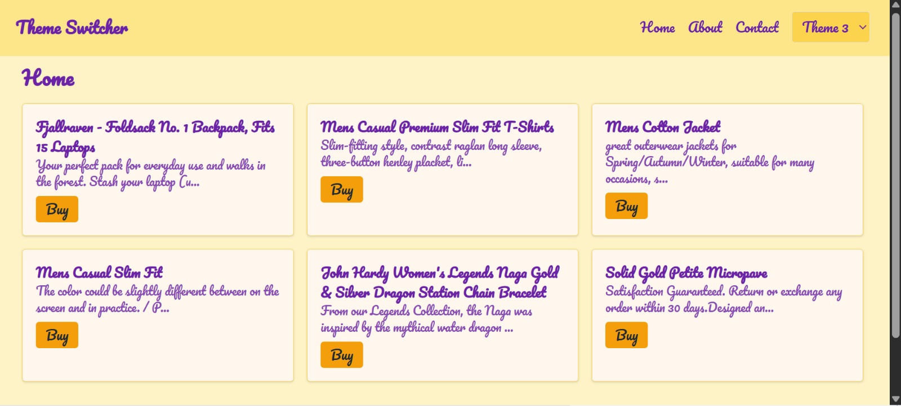

# 🎨 Multi-Theme Switcher App (React + TypeScript)

This is a responsive web application built with **React**, **TypeScript**, and **Tailwind CSS**, designed to demonstrate dynamic **theme switching** and **layout variations** across pages. The app integrates real API data, provides theme persistence, and supports three distinct visual themes.

---

## 📸 Preview

  
  


---

## 🚀 Features

- 🔄 Switch between **3 distinct themes**:
  - `Theme 1`: Minimalist, light background, sans-serif font
  - `Theme 2`: Dark mode with **sidebar layout**, serif font
  - `Theme 3`: Colorful card layout with **Pacifico** font
- 🗂️ **Sidebar layout** for Theme 2 only
- 🔠 **Font styles change** per theme
- 🧠 Theme persists using `localStorage`
- 📱 Fully **responsive** (mobile + desktop)
- 🧑‍🎨 Dynamic styling via **CSS variables**
- ⚡ **Axios** used for data fetching from `https://fakestoreapi.com`
- ⚙️ Powered by **React Context API** for theme management
- 🔁 Smooth transitions between themes

---

## 📂 Folder Structure

src/
├── api/ # Axios wrapper for product API
├── Components/ # Header, Layout, ThemeWrapper, etc.
├── Context/ # ThemeContext with custom hook
├── Pages/ # Home, About, Contact pages
├── App.tsx # Main app component
├── index.tsx # Root entry point
├── index.css # Tailwind + custom CSS variables


---

## 🧑‍💻 Tech Stack

- [React](https://reactjs.org/)
- [TypeScript](https://www.typescriptlang.org/)
- [Tailwind CSS](https://tailwindcss.com/)
- [Axios](https://axios-http.com/)
- [React Router DOM](https://reactrouter.com/)
- [Fake Store API](https://fakestoreapi.com/)

---

## ⚙️ Getting Started

### 1. Clone the repository

```bash
git clone https://github.com/faizqrs/Multi-Theme-Switcher.git

Cd Multi-Theme-Switcher


2. Install dependencies

npm install


3. Run the development server

npm start

App will be available at: http://localhost:3000


🔧 Customize Themes
Theme styles are defined using CSS variables inside index.css:

css
Copy code
/* Example for Theme 1 */
.theme1 {
  --bg: #f8fafc;
  --text: #111827;
  --header-bg: #ffffff;
  --header-text: #000000;
  --button-bg: #3b82f6;
  --button-text: #ffffff;
  --card-bg: #ffffff;
  --card-border: #e5e7eb;
  --font-family: sans-serif;
}
To add more themes or tweak existing ones, update the .themeX blocks and CSS variable values accordingly.

🌐 Deployment Live Link:


📧 Contact / Author
Author: Faisal Qureshi
Email: faisalqrs19@gmail.com
GitHub: github.com/faizqrs

✅ Assessment Checklist
 3 unique themes with different fonts/colors/layouts

 Theme persists using localStorage

 Header with theme switcher dropdown

 Sidebar layout for Theme 2

 React Context used

 Responsive design

 Axios + real API integration

 TypeScript + Tailwind

 Smooth transitions and animations

📄 License
This project is created for educational/assessment purposes and is open to extend or reuse for personal projects.


